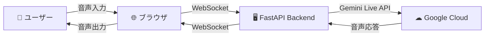

# ☕ Starlight Cafe - Gemini Live API 音声対話システム

**Google Cloud Gemini Live APIを活用したリアルタイム音声対話の技術デモ**

このデモは[Etsujiさんのvideo-monitoring-handson](https://github.com/google-cloud-japan/sa-ml-workshop/tree/main/video-monitoring-handson)のsample02アプリをベースに作成したものです。

架空のカフェ「Starlight Cafe」の電話対応をシミュレーションする、AIエージェントとの音声通話Webアプリです。

## 📋 コンテンツ全体像

### 🎪 デモの概要
- **テーマ**: 架空のカフェ「Starlight Cafe」の電話対応システム
- **AI エージェント**: Patrick（パトリック）- 親切な電話対応スタッフ
- **コア技術**: 
  - **フロントエンド ↔ バックエンド**: WebSocket通信
  - **バックエンド ↔ Google Cloud**: Gemini Live API
- **体験内容**: リアルタイム双方向音声ストリーミング

### 🏗️ アーキテクチャ



### 📁 プロジェクト構成

```
Cafe-Agent-Gemini/
├── README.md                    # このファイル
├── deploy.sh                    # Cloud Runへのデプロイスクリプト
├── backend/                     # バックエンド (FastAPI + Gemini Live API)
│   ├── main.py                 # メインアプリケーション
│   ├── requirements.txt        # Python依存関係
│   └── Dockerfile             # バックエンド用Dockerイメージ
└── frontend/                   # フロントエンド (Next.js)
    ├── pages/                  # Next.jsページ
    │   └── index.js           # メインページ
    ├── components/            # Reactコンポーネント
    │   └── VoiceClient.js     # 音声通話コンポーネント
    ├── lib/                   # ライブラリ
    │   ├── voicecall-backend.js    # バックエンドAPI接続
    │   └── live-audio-manager.js   # 音声入出力管理
    ├── package.json           # Node.js依存関係
    └── Dockerfile            # フロントエンド用Dockerイメージ
```

## 🔧 事前準備

### 1. **環境要件**
- **Node.js**: 22.15.0以上
- **Python**: 3.9以上
- **Google Cloud Platform**: アカウントとプロジェクト

### 2. **Google Cloud設定**

#### 📋 プロジェクト作成と課金設定
1. [Google Cloud Console](https://console.cloud.google.com/)でプロジェクトを作成
2. 課金アカウントを有効化（Gemini Live API使用に必要）

#### 🔑 認証設定（2つの方法から選択）

**方法A: Google Cloud SDK使用（推奨）**
```bash
# 1. Google Cloud SDKをインストール
# https://cloud.google.com/sdk/docs/install

# 2. 認証設定
gcloud auth login
gcloud auth application-default login
gcloud config set project YOUR_PROJECT_ID
```

**方法B: サービスアカウントキー使用**
```bash
# 1. Google Cloud Consoleでサービスアカウントを作成
# 2. キーファイル（JSON）をダウンロード
# 3. 環境変数を設定
export GOOGLE_APPLICATION_CREDENTIALS="path/to/your/key.json"
export GOOGLE_CLOUD_PROJECT="your-project-id"
```

#### 🚀 APIの有効化
```bash
# Vertex AI APIを有効化
gcloud services enable aiplatform.googleapis.com
```

### 3. **ローカル環境設定**

#### バックエンド
```bash
cd backend

# Python仮想環境作成
python -m venv venv

# 仮想環境有効化
# Windows:
venv\Scripts\activate
# macOS/Linux:
source venv/bin/activate

# 依存関係インストール
pip install -r requirements.txt
```

#### フロントエンド
```bash
cd frontend

# Node.js依存関係インストール
npm install

# 環境変数ファイル作成
echo "NEXT_PUBLIC_BACKEND_URL=ws://localhost:8081/ws" > .env.local
```

## 🎮 使用方法

### 🚀 アプリケーション起動

**ターミナル1: バックエンド起動**
```bash
cd backend
python main.py
# → http://localhost:8081 で起動
```

**ターミナル2: フロントエンド起動**
```bash
cd frontend
npm run dev
# → http://localhost:3000 で起動
```

### 🎙️ 音声対話の流れ

1. **🌐 ブラウザアクセス**: http://localhost:3000
2. **☕ 接続**: 「カフェに電話をかける」ボタンをクリック
3. **🎤 音声入力**: 「話し始める」ボタンを押して話しかける
4. **🤖 AI応答**: Patrickがリアルタイムで音声応答
5. **🔄 会話継続**: 自然な対話を楽しむ
6. **📞 終了**: 「通話を終了」ボタンで切断

### 💬 会話例

```
👤 ユーザー: 「メニューを教えてください」
🤖 Patrick: 「承知いたします。コーヒー類ではドリップコーヒーが450円、カフェラテが550円...」

👤 ユーザー: 「おすすめはありますか？」
🤖 Patrick: 「当店の人気No.1はカフェラテです。まろやかな味わいで...」

👤 ユーザー: 「カフェラテとアップルパイをお願いします」
🤖 Patrick: 「承知いたします。カフェラテとアップルパイですね。お受け取り時間は...」
```

## 🧑‍💻 サンプルコードの説明

### 📱 フロントエンド (`frontend/components/VoiceClient.js`)

#### 🔧 主要機能
- **WebSocket接続管理**: バックエンドとの双方向通信
- **音声入出力制御**: マイクアクセスとスピーカー出力
- **UI状態管理**: 接続状態、マイク状態の表示

### 🖥️ バックエンド (`backend/main.py`)

#### 🔧 主要機能
- **Gemini Live API連携**: リアルタイム音声AI処理
- **音声ストリーミング**: PCM音声データの双方向転送
- **WebSocketサーバー**: フロントエンドとの接続管理

#### 🎯 重要なカスタマイズポイント

**1. システムプロンプト（最重要）**
```python
SYSTEM_INSTRUCTION = '''
あなたは「Starlight Cafe」のPatrickです。
# 🎯 ここを編集してオリジナルエージェントを作成！
'''
```

**2. AI応答設定**
```python
AI_TEMPERATURE = 0.7  # 創造性レベル (0.0-1.0)
AI_TOP_P = 0.8        # 応答の多様性 (0.0-1.0)
```

**3. 音声設定**
```python
VOICE_NAME = 'Puck'     # 音声の種類: Puck, Aoede など
LANGUAGE = 'Japanese'   # 言語: Japanese, English, Korean
```

## 🎓 Next Step: システムプロンプト演習

### 📚 基礎課題

#### **課題1: カフェのカスタマイズ**
今のシステムプロンプト：
```python
SYSTEM_INSTRUCTION = '''
あなたは「Starlight Cafe（スターライトカフェ）」の電話対応スタッフのPatrick（パトリック）です。
親切で丁寧な対応で、お客様からの電話に応対してください。

【基本設定】
* あなたの名前：Patrick（パトリック）
* カフェ名：Starlight Cafe（スターライトカフェ）
* 営業時間：7:00〜22:00（年中無休）
* 所在地：東京都渋谷区にある温かい雰囲気のカフェ

【メニュー情報】
コーヒー類：
- ドリップコーヒー（ホット/アイス）：450円
- カフェラテ：550円
- カプチーノ：550円
- エスプレッソ：350円
おすすめはカフェラテです。

フード類：
- ホットサンドイッチ：780円
- 日替わりパスタ：1,00円
- チーズケーキ：480円
- アップルパイ：520円
おすすめは日替わりパスタです。

【対応の流れ】
1. 明るく挨拶をして、カフェ名と自分の名前を名乗る
2. お客様のご用件を伺う
3. 注文の場合は、メニューの説明、注文内容の確認、お受け取り時間の調整
4. 問い合わせの場合は、丁寧に回答
5. 最後に感謝の気持ちを伝える

【対応例】
- 予約・注文受付
- メニューの説明・おすすめ
- 営業時間・アクセス案内

【注意事項】
- 常に親切で温かい対応を心がける
- 分からないことは素直に「確認いたします」と伝える
- お客様の名前を伺い、親しみやすい雰囲気を作る
- 電話対応らしい丁寧な言葉遣いを使う

【重要】会話が開始されたら、必ず最初に「お電話ありがとうございます。Starlight Cafeのパトリックと申します。本日はどのようなご用件でしょうか？」と挨拶してください。
'''
```
`backend/main.py`のシステムプロンプトを編集して、オリジナルカフェを作成してみましょう。
```python
# 🎯 練習: 以下の要素を変更してみてください
SYSTEM_INSTRUCTION = '''
あなたは「_____（カフェ名）」の「_____（スタッフ名）」です。

【基本設定】
* カフェ名：_____
* 営業時間：_____
* 所在地：_____

【メニュー情報】
# 🎯 ここに独自のメニューを追加

【対応スタイル】
# 🎯 丁寧語、カジュアル、方言など選択
'''
```

#### **課題2: 異業種への変更**
カフェ以外のビジネスに変更してみましょう。

**例: 書店スタッフ**
```python
SYSTEM_INSTRUCTION = '''
あなたは「Starlight Books」の書店スタッフです。
お客様の本選びをお手伝いします。

【取り扱いジャンル】
- 小説、ビジネス書、技術書、漫画...

【サービス】
- 本の検索、おすすめ紹介、予約受付...
'''
```

### 🏆 応用課題

#### **課題3: 対話シナリオの拡張**
特定のシナリオに特化したエージェントを作成してみましょう。

**例: 予約専門エージェント**
```python
SYSTEM_INSTRUCTION = '''
【対応フロー】
1. 予約日時の確認
2. 人数の確認  
3. 特別なご要望の確認
4. 連絡先の確認
5. 予約内容の復唱確認

【制約条件】
- 予約は3日前まで
- 最大席数は50席
- 営業時間外は対応不可
'''
```

#### **課題4: 多言語対応**
```python
# 英語版エージェント
LANGUAGE = 'English'
SYSTEM_INSTRUCTION = '''
You are Patrick, a friendly staff member at Starlight Cafe.
Provide excellent customer service in English.
'''
```

### 🧩 穴埋め問題形式

#### **問題1: システムプロンプトの構成要素**
以下の空欄を埋めて、効果的なシステムプロンプトを完成させてください：

```python
SYSTEM_INSTRUCTION = '''
あなたは「_______」の「_______」です。

【基本情報】
* 名前：_______
* 役割：_______
* 営業時間：_______

【対応方針】
1. _______な挨拶から始める
2. お客様の_______を正確に把握する
3. _______な提案を行う
4. 最後に_______で締める

【注意事項】
- _______な言葉遣いを心がける
- 分からないことは「_______」と正直に伝える
'''
```

**解答例:**
```python
SYSTEM_INSTRUCTION = '''
あなたは「Ocean View Restaurant」の「マリン」です。

【基本情報】
* 名前：マリン
* 役割：電話予約担当スタッフ
* 営業時間：11:00〜22:00

【対応方針】
1. 明るい挨拶から始める
2. お客様のご要望を正確に把握する
3. 適切な提案を行う
4. 感謝の言葉で締める

【注意事項】
- 関西弁で返答してください。これは絶対に守ってください。
- 分からないことは「確認いたします」と正直に伝える
'''
```

#### **問題2: カスタマイズ実装**
以下の仕様に基づいてシステムプロンプトを実装してください：

**仕様:**
- 業種: ペットショップ
- スタッフ名: アニー
- 専門: 犬・猫のグッズ販売
- 特徴: 動物愛護に熱心、専門知識豊富

### 🎯 評価ポイント

良いシステムプロンプトの条件：
- ✅ **明確な役割定義**: 「誰として」振る舞うかが明確
- ✅ **具体的な知識**: メニュー、価格、サービス内容が詳細
- ✅ **対応フロー**: 会話の流れが定義されている
- ✅ **制約条件**: できること・できないことが明確
- ✅ **トーン設定**: 言葉遣いや性格が統一されている

## 🐛 トラブルシューティング

### よくある問題と解決方法

**❌ 認証エラー**
```
google.auth.exceptions.DefaultCredentialsError
```
→ Google Cloud認証を再実行: `gcloud auth application-default login`

**❌ 接続エラー**
```
WebSocket connection failed
```
→ `.env.local`ファイルの`NEXT_PUBLIC_BACKEND_URL`を確認

**❌ 音声が聞こえない**
→ ブラウザのマイク・スピーカー許可を確認

**❌ AIが応答しない**
→ システムプロンプトの内容とGemini Live APIの制限を確認

### 🆘 サポート

問題が解決しない場合は以下を確認してください：
1. **ログの確認**: ブラウザ開発者ツールとバックエンドログ
2. **環境変数**: 必要な設定がすべて正しく設定されているか
3. **ネットワーク**: ファイアウォールやプロキシの設定
4. **課金設定**: Google Cloudの課金が有効になっているか

## 📚 参考資料

- [Gemini Live API公式ドキュメント](https://ai.google.dev/gemini-api/docs/live)
- [Google Cloud認証ガイド](https://cloud.google.com/docs/authentication)
- [Etsujiさんのvideo-monitoring-handson](https://github.com/google-cloud-japan/sa-ml-workshop/tree/main/video-monitoring-handson)

## 🎉 まとめ

このハンズオンでは、Google Cloud Gemini Live APIを使ったリアルタイム音声対話システムの構築方法を学びました。システムプロンプトの調整により、様々な業種・用途のAIエージェントを作成できます。

**学習のポイント:**
- 🎯 システムプロンプトの重要性
- 🔄 リアルタイム音声ストリーミング
- 🏗️ WebSocket通信の活用
- 🎨 UIデザインの考慮事項

さあ、あなただけのオリジナルAIエージェントを作成してみましょう！ 
